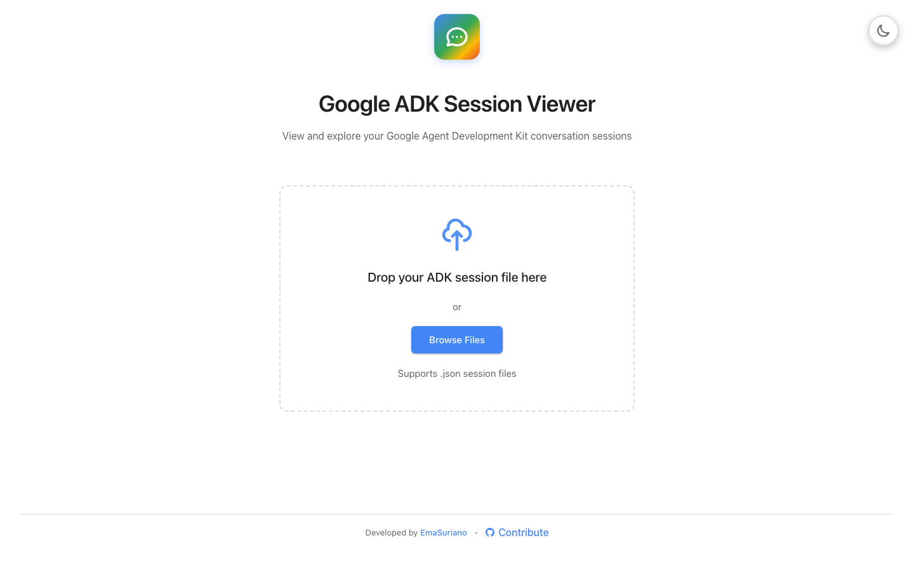
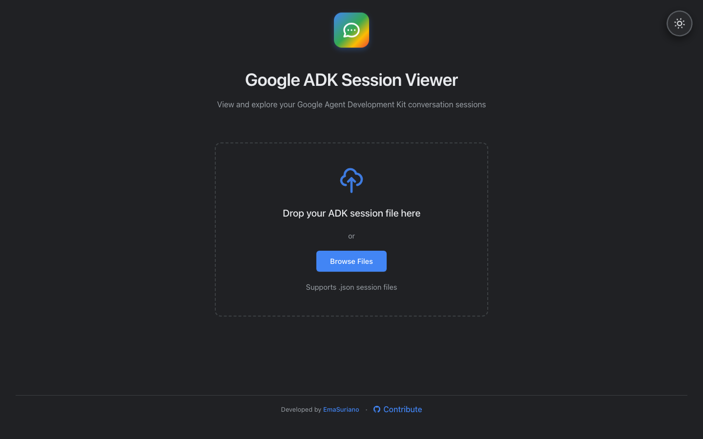
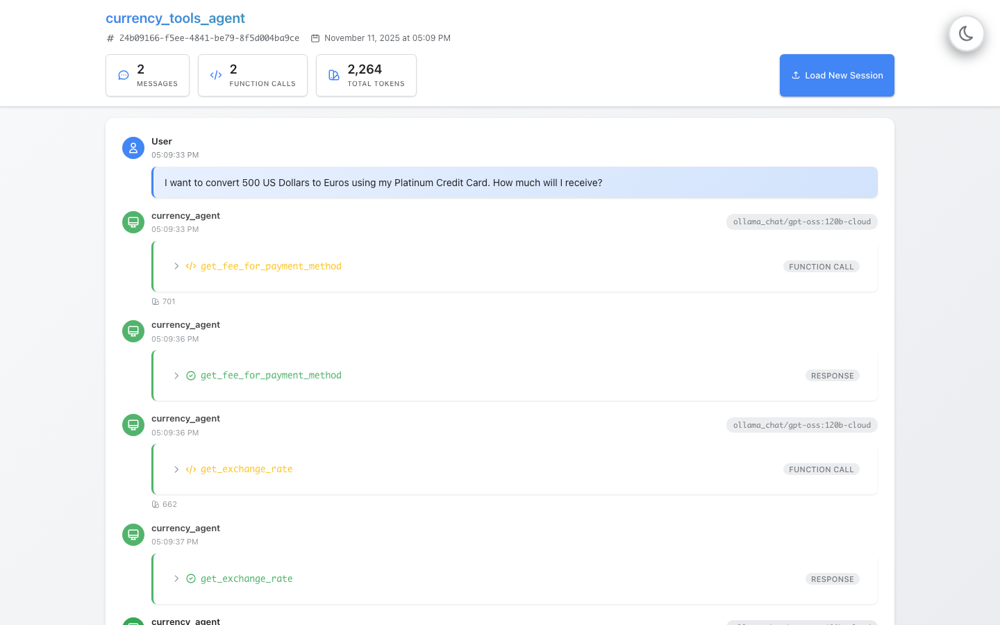
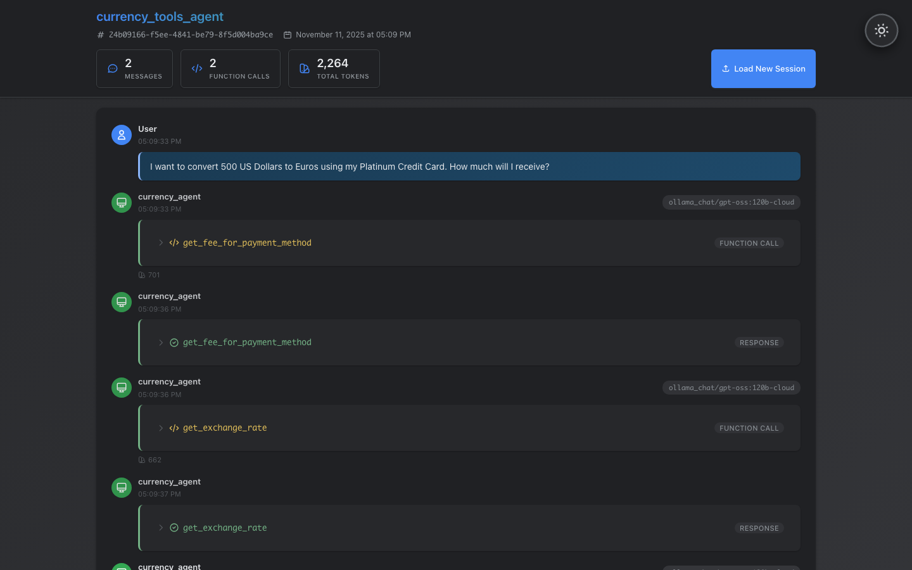

# Google ADK Session Viewer

A beautiful and modern web application to view and explore Google Agent Development Kit (ADK) conversation sessions. This viewer allows you to visualize agent conversations, function calls, and responses in an intuitive chat-like interface.

## Screenshots

| Screen         | Light Theme                               | Dark Theme                               |
| -------------- | ----------------------------------------- | ---------------------------------------- |
| Home Screen    |        |        |
| Session Viewer |  |  |

## Features

- 🎯 **Drag & Drop Interface** - Simply drag and drop your session JSON files
- 💬 **Chat-like UI** - View conversations in a familiar chat interface
- 🔧 **Function Call Visualization** - See function calls and responses clearly
- 📊 **Session Statistics** - View message counts, function calls, and token usage
- 🎨 **Modern Design** - Google Material Design with smooth animations
- 🌓 **Dark/Light Theme** - Toggle between dark and light modes
- 📱 **Responsive** - Works great on desktop and mobile devices
- 🚀 **GitHub Pages Ready** - Automatic deployment on push

## Getting Started

### Prerequisites

- Node.js (v18 or higher)
- Yarn or npm

### Installation

1. Clone the repository:

```bash
git clone <repository-url>
cd adk-session-reader
```

2. Install dependencies:

```bash
yarn install
# or
npm install
```

3. Start the development server:

```bash
yarn dev
# or
npm run dev
```

4. Open your browser and navigate to `http://localhost:5173`

## Usage

1. **Upload a Session File**:

   - Drag and drop a session JSON file onto the upload area
   - Or click "Browse Files" to select a file from your computer

2. **View the Session**:

   - See the conversation flow between user and agent
   - View function calls with their arguments
   - See function responses with results
   - Check session statistics at the top

3. **Load Another Session**:
   - Click "Load New Session" to return to the upload screen

## Session File Format

The viewer expects ADK session files in the following format:

```json
{
  "id": "session-id",
  "appName": "agent_name",
  "userId": "user",
  "state": {},
  "events": [
    {
      "content": {
        "parts": [
          {
            "text": "User message"
          }
        ],
        "role": "user"
      },
      "author": "user",
      "timestamp": 1234567890.123
    }
  ],
  "lastUpdateTime": 1234567890.123
}
```

## Project Structure

```
src/
├── components/
│   ├── FileUpload.tsx       # Drag & drop file upload component
│   ├── FileUpload.css
│   ├── ChatMessage.tsx      # Individual message component
│   ├── ChatMessage.css
│   ├── SessionViewer.tsx    # Main session viewer
│   └── SessionViewer.css
├── types/
│   └── session.ts           # TypeScript type definitions
├── App.tsx                  # Main application component
├── App.css
├── main.tsx                 # Application entry point
└── index.css                # Global styles
```

## Technologies Used

- **React 19** - UI framework
- **TypeScript** - Type safety
- **Vite** - Build tool and dev server
- **CSS3** - Styling with gradients and animations

## Building for Production

```bash
yarn build
# or
npm run build
```

The built files will be in the `dist` directory.

## Deployment to GitHub Pages

This project is configured to automatically deploy to GitHub Pages when you push to the `main` branch.

### Setup Instructions:

1. **Enable GitHub Pages in your repository:**

   - Go to your repository on GitHub
   - Navigate to **Settings** > **Pages**
   - Under **Source**, select **GitHub Actions**

2. **Push your code:**

   ```bash
   git add .
   git commit -m "Initial commit"
   git push origin main
   ```

3. **Automatic Deployment:**
   - The GitHub Actions workflow will automatically build and deploy your site
   - Your site will be available at: `https://<username>.github.io/adk-session-reader/`
   - Check the **Actions** tab to monitor the deployment progress

### Manual Deployment:

You can also trigger a manual deployment:

- Go to the **Actions** tab in your repository
- Select the "Deploy to GitHub Pages" workflow
- Click "Run workflow"

### Local Testing with Production Build:

```bash
yarn build
yarn preview
```

This will serve the production build locally at `http://localhost:4173`

## License

MIT

## Contributing

Contributions are welcome! Please feel free to submit a Pull Request.
